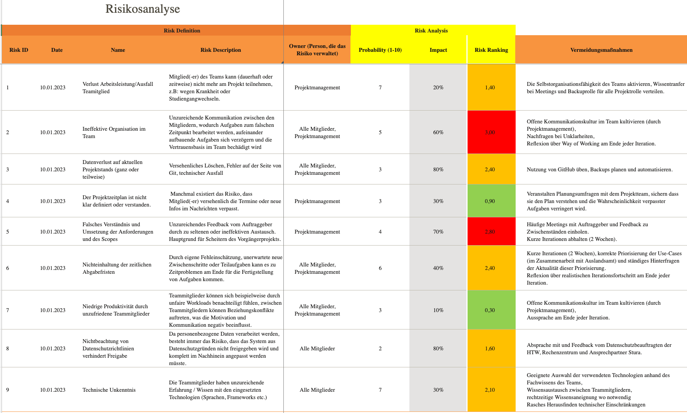

= Risikoliste: {project-name}
Vorname Nachname <email@domain.org>; Vorname2 Nachname2 <email2@domain.org>; Vorname3 Nachname3 <email3@domain.org>
{localdatetime}
include::../_includes/default-attributes.inc.adoc[]
// Platzhalter für weitere Dokumenten-Attribute

In diesem Dokument sind die wesentlichen Risiken des Projekts aufgeführt.

== 1.1. Attribute

Dabei werden folgende Attribute verwendet:

* *ID*: Identifizierungsmerkmal der einzelnen Risikos.
* *Datum*: Eintragungsdatum in Risikosliste.
* *Name*: Bezeichnung des Risikos.
* *Owner*: Verantwortliche Person für das Risiko.
* *Impact (Auswirkungen)*: Prozentangabe für die Auswirkungen, die auf das Projekt angibt, wenn das Risiko eintritt.
* *Probability (Wahrscheinlichkeit)*: Wert zwischen 1 (niedrig) und 10 (hoch) für die Eintrittswahrscheinlichkeit des Risikos.
* *Risk Ranking*: Risikofaktor
* *Gegenmaßnahmen*: Hinweise um die Faktoren soweit wie möglich zu reduzieren. 

== 1.2. Risiken

Die Risiken sind in folgender Tabelle: <<table_risks>> dargestellt. Das Datum des Dokuments oben gibt an, wann die Risikoliste zuletzt aktualisiert wurde.

*Allgemeine Hinweis*:

Grundsätzlich lassen sich Risiken in einem Projekt nicht vermeiden. Ziel ist es jedoch diese auf ein Minimum zu redurieren. Dazu gibt es bewährte Techniken. Wichtigster Bestandteil unserer Risikokominimierung ist es diese frühzeitig zu identifizieren und Gegenmaßnahmen festzusetzen. Dabei wird in jedem Teammeeting der aktuelle Projektstand geupdatet und auf Grundlage des aktuellen Standes die Risikoliste aktualisiert. Dabei ändern sich Wahrscheinlichkeit für das Eintreten eines Risikos kontinuierlich. Ziel ist es diesen Faktor soweit wie möglich zu reduzieren. Anhang der Wahrscheinlichkeitsentwicklung lässt sich ableiten, wie effektiv die eingesetzten Gegenmaßnahmen tatsächlich waren (bzw. sind). Daraus lassen sich gezielt die Schwachpunkte bestimmen (z.B.: in der Projektsplanung). Diese sind dann der zentrale Fokus im Projektmanagement für die nächste Iteration. Die Kontrolle der Reduzierung unterliegt dem Projektmanagement. 

Die dazugehörige Excel-Tabelle befindet sich im Github im Ordner docs/project_management. 

// Die inkludierte csv-Datei "risks.csv" verwendet `;` Semmikolons als Trennzeichen. Achten Sie beim Export als csv-Datei auf das Angeben des entsprechenden Trennzeichens. Verwenden Sie stattdessen `,` Kommas, kann das Tabellenattribut `separator=` weggelassen werden oder muss entprechend angepasst werden.

// PDF-Export: Seite im Querformat
[.landscape]
<<<

// table risks
[#table_risks]
.Risiken
[%header, format="csv", separator=";", cols="^1,^2,3,4,3,^1,^1,^1,3,4"]
|===
include::risks.csv[]
|===

// PDF-Export: Seite zurück zum Hochformat
[.portrait]
<<<

